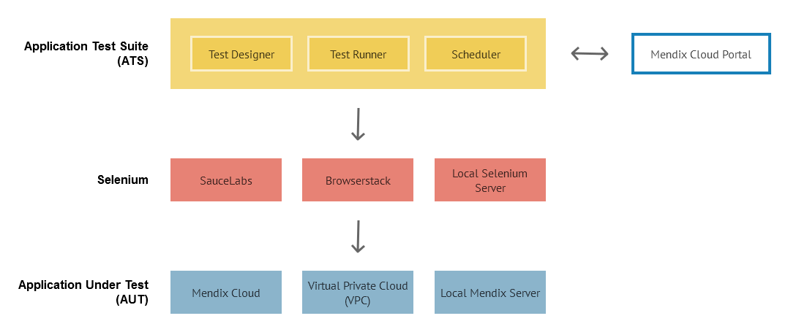
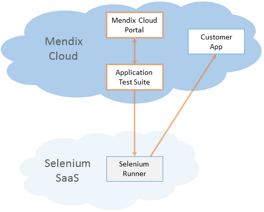
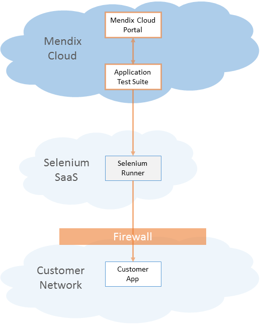
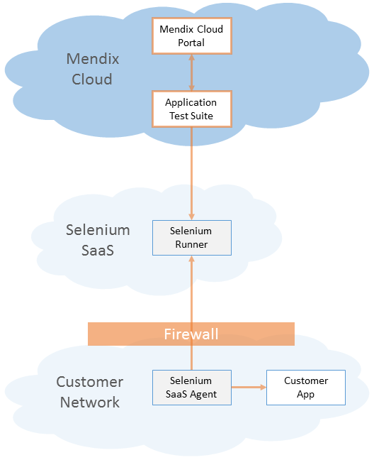
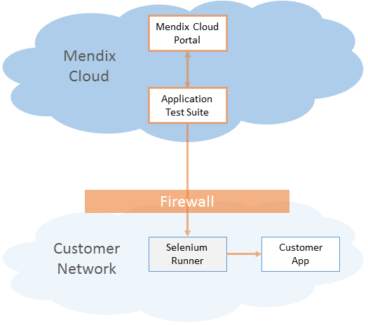

This document describes the supported deployment scenarios for the Application Test Suite (ATS).

# Components
Every ATS deployment consists of four components, the ATS application, the Mendix Cloud Portal, a Selenium Runner as well as your Application Under Test (AUT).

The following diagram illustrates how the components are connected.



## Application Test Suite (ATS) Application
The ATS application provides the GUI to create, managed and run your tests.

## Mendix Cloud Portal
The Mendix Cloud Portal is provided as a cloud service by Mendix. It hosts your projects, user stories and other related data which is also used by the ATS application.

## Selenium Runner
The Selenium Runner is used to execute your tests. Once you trigger a test run from ATS, ATS will connect to your Selenium Service provider to start the test. The Selenium Runner then starts the browser and executes the commands that it receives from ATS.

## Application Under Test (AUT)
The Application Under Test (AUT) is the deployed Mendix application that you want to test.

# Deployment Options
There is one standard deployment option as well as 3 alternative options. The standard option is recommended since it is optimized in terms of setup, ease of use, maintenance and features.

## Comparing the Options
Before you pick your option you need to be aware of the differences. The following two sections will help you to make your choice.

### Features

Feature                       | Standard               | Alternative 1                          | Alternative 2                          | Alternative 3
----------------------------- | ---------------------- | -------------------------------------- | -------------------------------------- | --------------------------------------
Test Automation               | :white_check_mark: Yes | :white_check_mark: Yes                 | :white_check_mark: Yes                 | :white_check_mark: Yes
Test Recording                | :white_check_mark: Yes | :white_check_mark: Yes                 | :white_check_mark: Yes                 | :white_check_mark: Yes
OS Selection                  | :white_check_mark: Yes | :white_check_mark: Yes                 | :white_check_mark: Yes                 | :no_entry_sign: No
Responsive Testing            | :white_check_mark: Yes | :white_check_mark: Yes                 | :white_check_mark: Yes                 | :no_entry_sign: No
Multiple Browsers<sup>1</sup> | :white_check_mark: All | :white_check_mark: All                 | :white_check_mark: All                 | :grey_exclamation: Limited<sup>3</sup>
Mobile Testing<sup>2</sup>    | :white_check_mark: Yes | :white_check_mark: Yes                 | :white_check_mark: Yes                 | :no_entry_sign: No
Mendix Platform Integration   | :white_check_mark: All | :grey_exclamation: Limited<sup>4</sup> | :grey_exclamation: Limited<sup>4</sup> | :grey_exclamation: Limited<sup>4</sup>
Live View & Video<sup>2</sup> | :white_check_mark: Yes | :white_check_mark: Yes                 | :white_check_mark: Yes                 | :no_entry_sign: No
Future Proof                  | :white_check_mark: Yes | :white_check_mark: Yes                 | :white_check_mark: Yes                 | :no_entry_sign: No

<sup>1</sup> Only if supported by ATS.  
<sup>2</sup> Feature not available yet.  
<sup>3</sup> Additional setup for every browser required.  
<sup>4</sup> Some future integrations require that your app runs in the Mendix Cloud.

### Setup and Maintenance
The following matrix compares the efforts for setup and maintenance of the different options.

Aspect                           | Standard                           | Alternative 1                           | Alternative 2                          | Alternative 3
-------------------------------- | ---------------------------------- | --------------------------------------- | -------------------------------------- | --------------------------------------
Firewall Setup                   | :white_check_mark: None            | :no_entry_sign: Required                | :white_check_mark: None<sup>1</sup>    | :no_entry_sign: Required
Selenium<sup>2</sup> Setup       | :white_check_mark: Yes<sup>3</sup> | :white_check_mark: Yes<sup>3</sup>      | :white_check_mark: Yes<sup>3</sup>     | :no_entry_sign: Customer responsibility
Selenium<sup>2</sup> Maintenance | :white_check_mark: Yes<sup>3</sup> | :white_check_mark: Yes<sup>3</sup>      | :white_check_mark: Yes<sup>3</sup>     | :no_entry_sign: Customer respoinsibility
Selenium<sup>2</sup> Support     | :white_check_mark: Yes<sup>3</sup> | :white_check_mark: Yes<sup>3</sup>      | :white_check_mark: Yes<sup>3</sup>     | :no_entry_sign: No

<sup>1</sup> A Selenium SaaS Agent with VPN is used to surpass the company network firewall.  
<sup>2</sup> Selenium is an open-source 3rd party component, not maintained/supported by Mendix.  
<sup>3</sup> Provided by your Selenium SaaS provider.

## Standard


The standard option is highly recommended for all customers. It supports all current and future features, is easy to setup, maintenance free and gets the best support.

## Alternative Option 1


Alternative Option 1 is meant for customers who run their app on premise. Since the app runs on premise it is protected from external access via a firewall. In order to allow the Selenium Runner to access the app you have to configure your firewall.

### Firewall Configuration
The firewall should accept connections from the internet either on port 80 (if you use http) or port 443 (if you use https) and forward to the web server of your Mendix application.

## Alternative Option 2


Alternative Option 2 is meant for customers who run their app on premise and who don't want to open their firewall for the Selenium Runner. In order to enable communication between the Selenium Runner and your local application you have to deploy a *Selenium Saas Agent* in your local network. This agent will establish a VPN tunnel to your Selenium Service Provider and route all traffic between the Selenium Runner and your application.

### Agent Setup
The setup of the agents depends on your provider.

Selenium Service | Agent Name          | Setup Instructions
---------------- | ------------------- | ------------------
BrowserStack     | BrowserStack Local  | [Here](https://www.browserstack.com/local-testing)
SauceLabs        | Sauce Connect Proxy | [Here](https://wiki.saucelabs.com/display/DOCS/Setting+Up+Sauce+Connect+Proxy)
TestingBot       | TestingBot Tunnel   | [Here](https://testingbot.com/support/other/tunnel)

## Alternative Option 3


Alternative Option 3 is meant for customers who run their app on premise and who also want to run their own Selenium Runner. The challenging part of this option is that the customer needs to setup, maintain and operate its own Selenium Runner.

<div class="alert alert-warning">
Selenium is an open-source 3rd party component and there's no active support from Mendix.
</div>

 Since the Selenium Runner offers a lot less features compared to Selenium SaaS Providers, it is not possible to make use of the full ATS features set.

 <div class="alert alert-warning">
The feature set in this option is limited.
 </div>

### Selenium Runner Setup
We provide basic installation instructions for the Selenium Runner based on Docker containers. For details we advise to read the official documentation for Docker [here](https://docs.docker.com/engine/getstarted/) and for Selenium [here](http://www.seleniumhq.org/docs/) and [here](https://github.com/SeleniumHQ/docker-selenium).

<div class="alert alert-info">
The current ATS version requires Selenium version 2.53.1. If ATS upgrades to a newer Selenium version the customer is obligated to upgrade its Selenium Runner to the new version as well.
</div>

Before you start please make sure that your server has internet access to download the container images.

1. Install Docker on your server as described [here](https://docs.docker.com/engine/installation/).
1. Install Docker Compose as described [here](https://docs.docker.com/compose/install/).
1. Create a folder _selenium_ in the user's home directory.
1. Change to the folder and create a file _docker-compose.yml_ with this content:
    ```yaml
    seleniumhub:
        image: selenium/hub:2.53.0
        ports:
        - 4444:4444

    firefoxnode:
        image: selenium/node-firefox:2.53.0
        ports:
        - 5900
        links:
        - seleniumhub:hub

    chromenode:
        image: selenium/node-chrome:2.53.0
        ports:
        - 5900
        links:
        - seleniumhub:hub
    ```
1. Start up the Selenium grid with this command:
    ```sh
    docker-compose up -d
    ```
1. You now have a grid running on _http://myserver:4444/wd/hub_. Attached to this grid are two nodes, one for Chrome and one for Firefox. You can easiliy scale by starting new nodes with a simple command. This example will start up a second node for both Firefox and Chrome:
```sh
docker-compose scale firefoxnode=2 chromenode=2
```