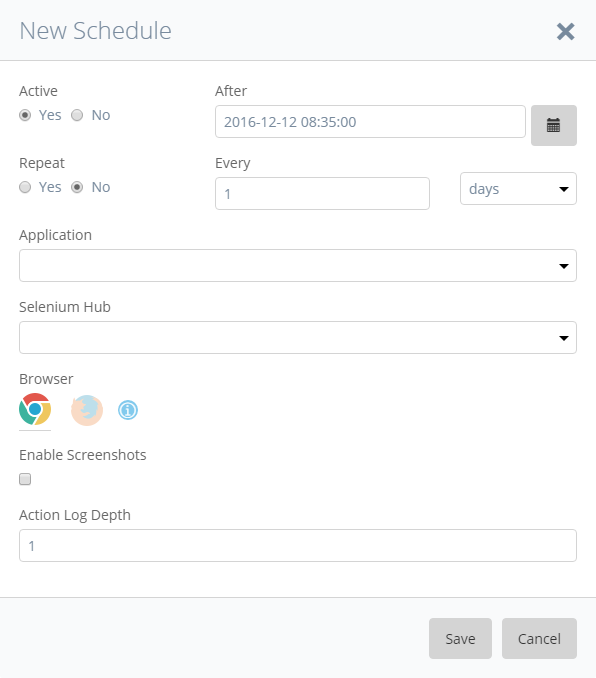
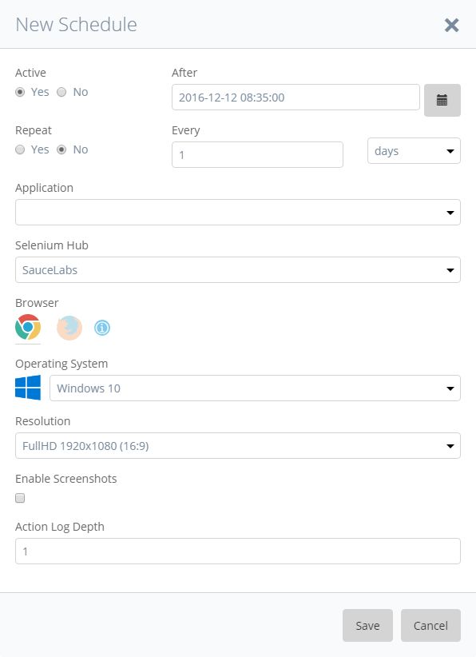

Scheduling allows to plan the execution of test cases and test suites at defined dates. You can add test cases and test suites by clicking the respective button.

Select a test case or test suite from the search dialog, provide a schedule date and time as well as a valid run configuration and application under test and click Save to add the item to the list of scheduled items. If the test case or test suite execution shall take place repeatedly, you can provide an interval after which the repeating will take place. The item will then repeatedly be executed until you mark it as inactive or until you remove the interval settings.

If you have selected a selenium hub from a supported selenium hub provider (TestingBot, SauceLabs or Browserstack), you will get access to the operating system and screen resolution selection.

Scheduled Test Settings:

**Active**

Activate/Deactivate the event

**Repeat**

Set event to repeat after a set time

**After**

Set time when event is first executed

**Every**

Set the intervall for the event to repeat

**Application**

Set the application on which the test is run

**Selenium Hub**

Set the Selenium hub on which the test is executed

**Browser**

Set the browser in which the test is run

**Operating System**

If you have selected a selenium hub from a supported selenium hub provider (TestingBot, SauceLabs or Browserstack), you will get access to the operating system selection. Here you can set the operating system, on which the test case will be run on.

This option is only available for supported Selenium hubs.

If you want to read more about the different supported operating system, read the [Supported selenium hub provider section](supported-selenium-hub-provider) of this documentation.

**Resolution**

This option is only available, if you have selected a selenium hub from a supported selenium hub provider and a valid operating system. With this option, you can set the screen resolution of the operating system you have selected earlier. The available screen resolutions are the supported resolutions for the operating system given by the selenium hub provider.

This option is only available for supported Selenium hubs.

If you want to read more about the different supported screen resolutions, read the [Supported selenium hub provider section](supported-selenium-hub-provider) of this documentation.

**Enable Screenshots**

Enable the taking of screenshots during the test run

**Action Log Depth**

Set depth of the error logging
